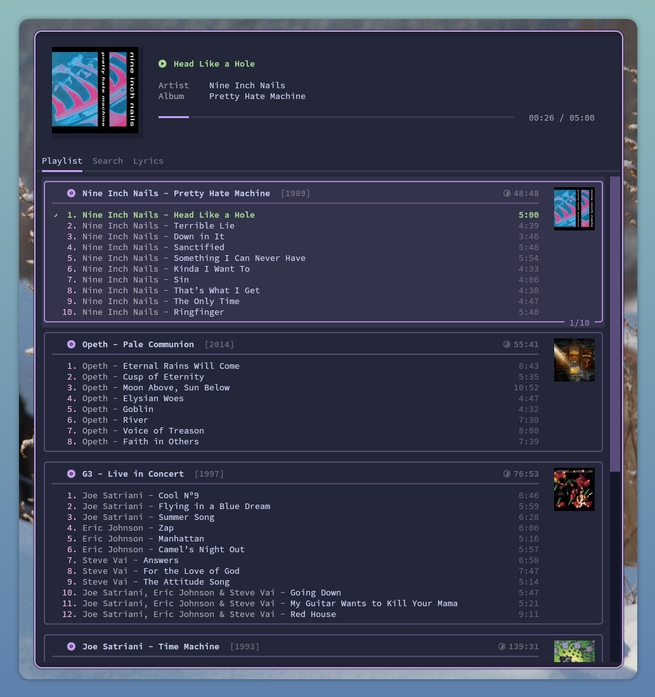

# CAPY

Terminal-based (TUI) music player for subsonic api compatible players (subsonic, navidrome, etc)



## Is it usable?

Frankly this player is for myself, it is constructed the way I like to listen to music (random albums,
fast search do go to a specific song/album/artist)

## How is this made?

It is written in python, using:

- [textual](https://textual.textualize.io/) library and [textual-image](https://github.com/lnqs/textual-image) for the interface;
- [pysonic](https://github.com/crustymonkey/py-sonic) as the backend to connect to the music server;
- [gstremer](https://gstreamer.freedesktop.org/) for the audio;
- [pylast](https://gstreamer.freedesktop.org/) for the last.fm integration.

## Is this AI slop?

Nope, this is 100% "organic" software with no AI used.

## How to run?

Create environment variables with the following content:

```sh
SUBSONIC_HOST="http://server"
SUBSONIC_USER=""
SUBSONIC_PASSWORD=""
SUBSONIC_PORT=4533

LASTFM_APIKEY=""
LASTFM_APISECRET=""
LASTFM_USER=""
LASTFM_PASSHASH=""
```

A few keybindings:

- **N** - Next song
- **Space** - Toggle play/pause
- **Ctrl+N** - Recreate playlist with 4 random albums
- **/** - Go to search
- **Escape** - On search, cancel and return to playlist
- **Q** - Quit
- **J, Down** - Go down on playlist/search
- **K, Up** - Go up on playlist/search
- **Enter** - Start playing selected song/album/artist
- **Ctrl+P** - Textual app menu, where you can change theme

## What is on the roadmap?

- I'd want to improve the "smart playlist" capabilities of the player in the future (when it
  loads a new random album, to use genre/artist/etc)

- Create a config tab to set variables instead of env variable file (and allow more configurations)
